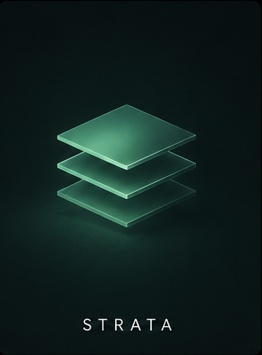
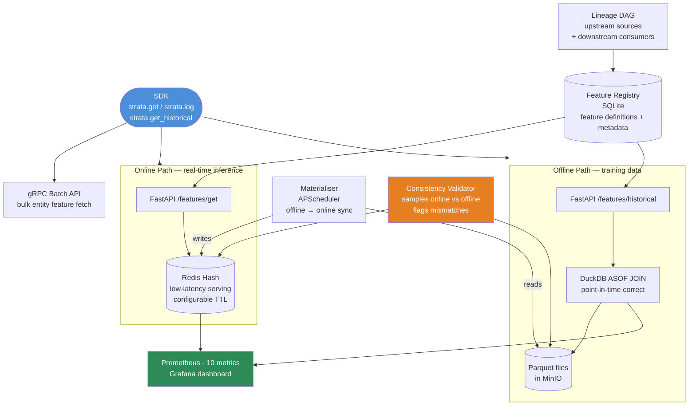
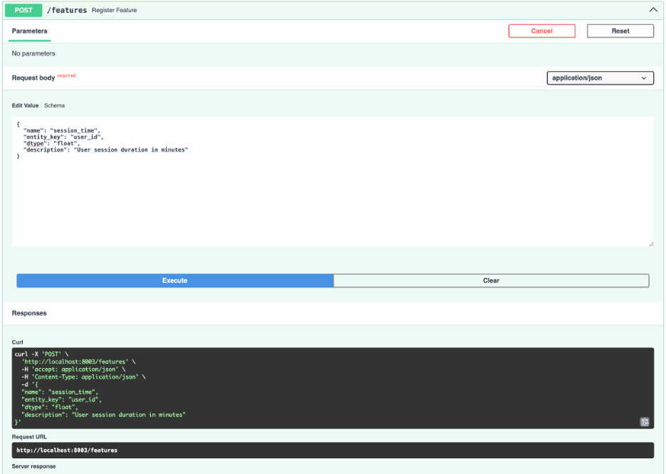
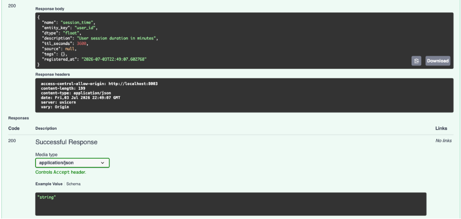
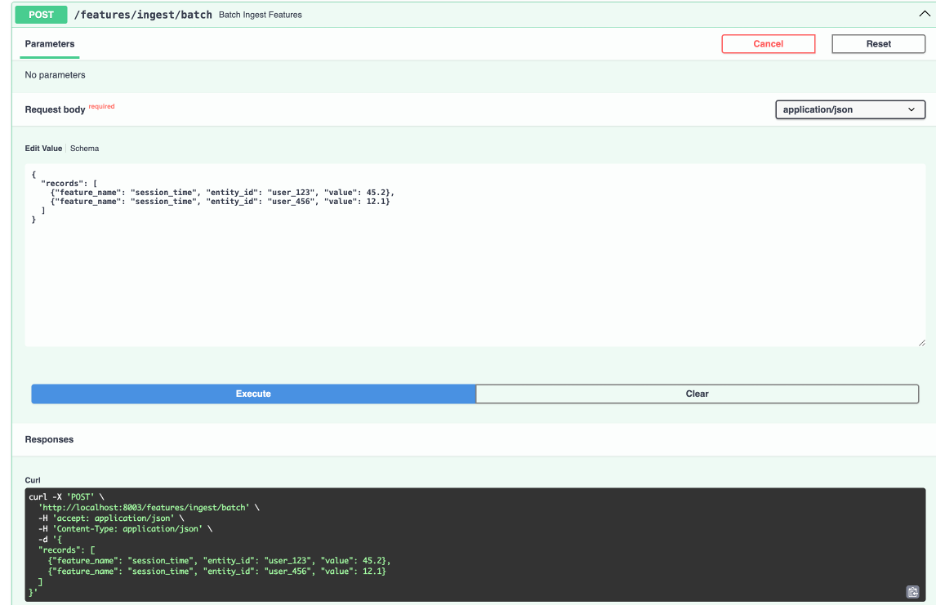
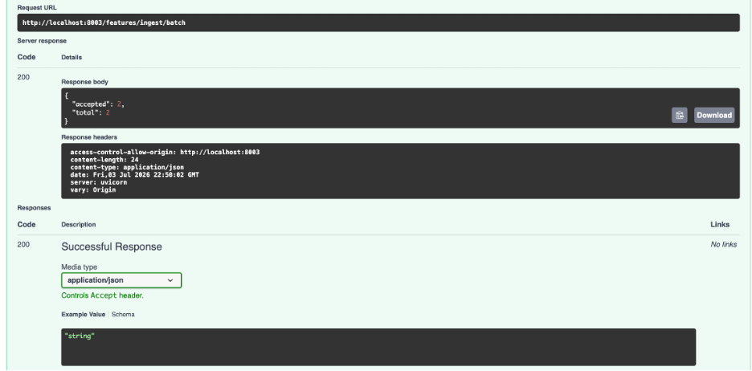
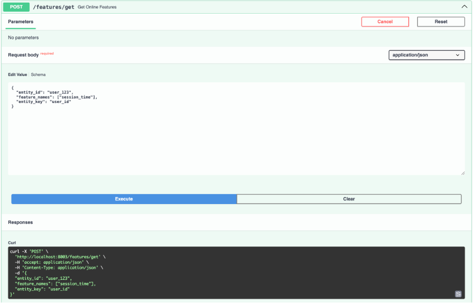
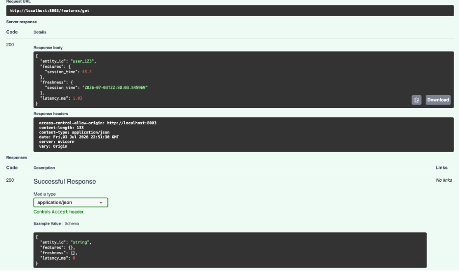

<p align="center">
  
</p>

<h1 align="center">Strata</h1>

<p align="center">
  <strong>Distributed Feature Store</strong>
</p>

<p align="center">
  Dual-store feature store with Redis online serving, DuckDB/Parquet offline storage,
  MinIO-backed artifacts, and point-in-time correct ASOF joins.
</p>

<p align="center">
  
  
  
  
  
</p>

---

## Overview

**Strata** is a local-first feature store designed to prevent training-serving skew.

It provides two coordinated storage paths:

* a **Redis-backed online store** for low-latency real-time inference
* a **DuckDB/Parquet/MinIO offline store** for historical training data

Feature values are ingested into the offline store, materialized into the online store, and retrieved historically using DuckDB's ASOF JOIN to preserve point-in-time correctness.

---

## Why It Matters

Training-serving skew is one of the most common causes of silent model degradation. It happens when a training dataset uses feature values that would not have been available at prediction time.

That creates future leakage: the model appears strong offline, but performs worse in production.

Strata addresses this by maintaining historical feature values and retrieving the most recent feature value available before each label event.

---

## Why ASOF JOIN Matters

Without point-in-time correctness:

```text id="dzxco5"
label event at 12:00
  ✗ use feature computed at 14:00
  → future leakage
  → inflated offline metrics
```

With ASOF JOIN:

```text id="0yx4va"
label event at 12:00
  ✓ use feature computed at 11:00
  → clean training data
  → honest offline evaluation
```

DuckDB's native ASOF JOIN makes this historical lookup efficient and explicit.

---

## Architecture



---

## Features

* **Feature definition DSL** for registering names, types, TTLs, and metadata
* **Redis online store** for low-latency serving
* **DuckDB/Parquet offline store** with append-only feature history
* **MinIO object storage** for local S3-compatible Parquet storage
* **Point-in-time historical retrieval** using DuckDB ASOF JOIN
* **Offline-to-online materialization** with APScheduler
* **Consistency validation** between online and offline stores
* **Feature lineage DAG** for tracking sources and downstream consumers
* **Python SDK** with `strata.get()`, `strata.log()`, and `strata.get_historical()`
* **gRPC batch API** for bulk feature retrieval
* **Prometheus metrics** for latency, freshness, materialization, and consistency
* **Grafana dashboard** for feature store monitoring

---

## Tech Stack

| Area           | Tools                  |
| -------------- | ---------------------- |
| API            | FastAPI, gRPC          |
| Online Store   | Redis                  |
| Offline Store  | DuckDB, Parquet        |
| Object Storage | MinIO                  |
| Registry       | SQLite                 |
| Scheduling     | APScheduler            |
| SDK            | Python client          |
| Metrics        | Prometheus             |
| Dashboard      | Grafana                |
| Runtime        | Docker, Docker Compose |

---

## Project Structure

```text id="odzo9f"
strata/
├── strata_core/
│   ├── main.py              # FastAPI app, lifespan, all routes
│   ├── online_store.py      # Redis Hash online store
│   ├── offline_store.py     # DuckDB + Parquet + MinIO offline store
│   ├── registry.py          # SQLite feature registry
│   ├── asof_engine.py       # DuckDB ASOF JOIN point-in-time retrieval
│   ├── materialiser.py      # APScheduler materialisation jobs
│   ├── validator.py         # Online vs offline consistency checker
│   ├── lineage.py           # Feature lineage DAG
│   ├── metrics.py           # Prometheus metrics
│   └── models.py            # Pydantic models
├── config/
│   ├── settings.py
│   └── config.yaml
├── sdk/
│   └── client.py            # Python SDK
├── proto/
│   └── strata.proto         # gRPC service definition
├── tests/                   # Pytest test suite
├── demo/
│   └── fraud_feature_store.py
├── docker-compose.yml
├── prometheus.yml
└── requirements.txt
```

---

## Quickstart

### 1. Install dependencies

```bash id="vfv6ae"
cd strata
pip install -r requirements.txt
```

### 2. Start infrastructure

```bash id="oeutfb"
docker compose up redis minio prometheus grafana -d
```

### 3. Start Strata

```bash id="dz3y3k"
uvicorn strata_core.main:app --port 8003 --reload
```

### 4. Run tests

```bash id="280qqq"
pytest tests/ -v
```

### 5. Run the demo

```bash id="rjbned"
python demo/fraud_feature_store.py
```

---

## SDK Usage

```python id="khex5o"
import sdk as strata
from datetime import datetime

strata.init("http://localhost:8003")

# Online serving path
features = strata.get("user_001", ["tx_count_1h", "avg_amount_7d"])

# Point-in-time historical path
history = strata.get_historical(
    entity_ids=["user_001", "user_002"],
    timestamps=[datetime(2024, 1, 15), datetime(2024, 1, 16)],
    feature_names=["tx_count_1h", "avg_amount_7d"],
)

# Ingest a feature value
strata.log("tx_count_1h", "user_001", 42.0)
```

---

## API Endpoints

| Method | Path                           | Description                     |
| ------ | ------------------------------ | ------------------------------- |
| POST   | `/features`                    | Register a feature              |
| GET    | `/features`                    | List all features               |
| POST   | `/features/get`                | Online feature get              |
| POST   | `/features/batch-get`          | Batch online get                |
| POST   | `/features/ingest`             | Ingest a feature value          |
| POST   | `/features/ingest/batch`       | Ingest feature values in batch  |
| POST   | `/features/historical`         | Point-in-time historical lookup |
| POST   | `/features/{name}/materialise` | Materialize a feature now       |
| POST   | `/features/{name}/validate`    | Run consistency validation      |
| GET    | `/features/{name}/lineage`     | Get feature lineage             |
| GET    | `/health`                      | Health check                    |
| GET    | `/metrics`                     | Prometheus metrics              |

Interactive docs:

```text id="mi8ebu"
http://localhost:8003/docs
```

---

## Observability

Strata exposes Prometheus metrics at:

```text id="h7xtdm"
http://localhost:8003/metrics
```

### Metrics

| Metric                                | Type      | Description                                |
| ------------------------------------- | --------- | ------------------------------------------ |
| `strata_online_reads_total`           | Counter   | Online store reads by feature and hit/miss |
| `strata_online_latency_seconds`       | Histogram | Online read latency                        |
| `strata_offline_reads_total`          | Counter   | Offline ASOF join reads                    |
| `strata_offline_latency_seconds`      | Histogram | Offline join latency                       |
| `strata_ingestion_total`              | Counter   | Feature values ingested by store           |
| `strata_materialisation_runs_total`   | Counter   | Materialization runs by status             |
| `strata_materialisation_lag_seconds`  | Gauge     | Lag since last materialization             |
| `strata_feature_freshness_seconds`    | Gauge     | Age of most recent online value            |
| `strata_consistency_mismatches_total` | Counter   | Online vs offline mismatches               |
| `strata_registered_features_total`    | Gauge     | Total registered features                  |

---

## Demo

```bash id="fa40n4"
python demo/fraud_feature_store.py
```

The demo flow:

```text id="bk6na8"
Registers features
Ingests historical feature data
Runs ASOF historical lookup
Checks online/offline consistency
```

Manual online get:

```bash id="l7svq2"
curl -X POST http://localhost:8003/features/get \
  -H "Content-Type: application/json" \
  -d '{"entity_id": "user_001", "feature_names": ["tx_count_1h"]}'
```

---

## Screenshots













---

## Tests

```bash id="w0x8ax"
pytest tests/ -v
```

With coverage:

```bash id="pf77i8"
pytest tests/ -v --cov=strata_core
```

The test suite covers feature registration, online get/set, offline ASOF joins, materialization, consistency validation, lineage, metrics, and SDK behavior.

---

## Known Limitations

* **Redis required for online serving**: The online path depends on Redis Hash operations.
* **MinIO required for offline storage**: The offline Parquet store uses MinIO as its local S3-compatible backend.
* **gRPC stubs must be generated**: The batch API is defined in `proto/strata.proto`, but generated stubs are not committed.
* **No schema evolution**: Changing a feature type after registration is not supported.
* **Append-only materialization**: The materializer syncs latest offline values to online and does not backfill historical online values.
* **Single-machine design**: Strata is built as a local feature store, not a distributed production alternative to Feast or Tecton.

---

## Future Work

* Feature versioning and schema evolution
* Streaming ingestion through Kafka or Flink-compatible connectors
* Multi-language SDKs for Go and Java
* Redis Cluster support
* Integration with Argus for feature monitoring
